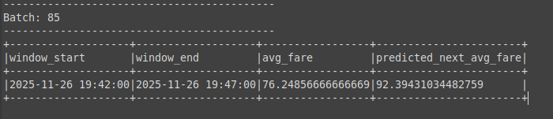

# Handson-L10-Spark-Streaming-MachineLearning-MLlib

# **Real-Time Taxi Fare Prediction – Task 4 & Task 5**

This repository contains the solutions for:

* **Task 4: Basic Streaming Ingestion & Real-Time Fare Prediction**
* **Task 5: Anomaly Detection using Prediction Deviation**

Both tasks use **Apache Spark Structured Streaming** and **Spark MLlib** to train a regression model offline and apply it to live streaming data from a socket source.

---

#  **Repository Structure**

```
.
├── task4.py       # Offline model training + real-time prediction
├── task5.py     # Includes deviation scoring for anomalies
├── data_generator.csv           # Provided dataset
├── models/
│   └── fare_model/                # Saved Linear Regression model
    └── fare_trend_model_v2/  
├── README.md
└── screenshots/
    ├── task4img.png
    ├── task5img.png
```

> NOTE: The `screenshots/` folder can be renamed or reorganized as needed.
> Insert your own output images where indicated below.

---

#  **Task 4: Basic Streaming Ingestion & Parsing**

###  Goal

Train a **Linear Regression** model using historical ride data and apply it to **incoming streaming trips** to predict taxi fares in real time.

### ✔Steps Implemented

1. **Offline Model Training**

   * Reads `training-dataset.csv`
   * Casts `distance_km` and `fare_amount` columns to `DoubleType`
   * Uses a `VectorAssembler` to create `features`
   * Trains a **Linear Regression** model to predict `fare_amount`
   * Saves model to `models/fare_model/`

2. **Streaming Inference**

   * Reads live JSON input from socket
   * Parses JSON using a defined schema
   * Uses same `VectorAssembler` to prepare streaming features
   * Loads the saved regression model
   * Predicts `predicted_fare` for each incoming ride

###  **Expected Output (Task 4)**

Columns printed in streaming output:

| Column           | Description                                  |
| ---------------- | -------------------------------------------- |
| `trip_id`        | Unique trip identifier                       |
| `driver_id`      | Driver number                                |
| `distance_km`    | Trip distance                                |
| `fare_amount`    | Actual fare                                  |
| `predicted_fare` | Model’s predicted fare                       |
| `deviation`      | Distance between actual & predicted (Task 5) |

---

##  **Task 4 – Output Screenshot**


---

#  **Task 5: Deviation-Based Anomaly Detection**

###  Goal

Extend Task 4 by computing the **absolute deviation** between actual fare and predicted fare:

```
deviation = ABS(fare_amount - predicted_fare)
```

High deviation indicates a possible anomaly such as:

* Overcharging
* Incorrect sensor distance
* Fraudulent fare manipulation

###  Enhancements from Task 4

* Adds a column `deviation` to the streaming output
* Still operates in real-time using the same trained model
* Outputs structured, append-mode logs with anomaly indicators

### **Expected Output (Task 5)**

Example row:

```
+------------------+----------+------------+-----------+--------------+----------+
| trip_id          | driver_id| distance_km| fare_amount | predicted_fare | deviation |
+------------------+----------+------------+-----------+--------------+----------+
```

---

## **Task 5 – Output Screenshot**


---

# **How to Run**

###  Start the streaming server

In a separate terminal:

```bash
python3 data_generator.py
```

Then send valid JSON per line:

```json
{"trip_id":"t1", "driver_id":12, "distance_km":5.1, "fare_amount":18.0, "timestamp":"2025-01-10 12:30:00"}
```

---

###  Run Task 4 script

```bash
python task4.py
```

###  Run Task 5 script

```bash
python task5.py
```

---

# Final Explanation/Approach

### **Task 4 – Real-Time Fare Prediction**

* Loaded the historical `training-dataset.csv` and cast numeric columns (`distance_km`, `fare_amount`) to `DoubleType` for ML compatibility.
* Used a **VectorAssembler** to create a feature vector from `distance_km`.
* Trained a **Linear Regression model** to predict `fare_amount` based on distance.
* Saved the trained model locally so it can be reused during streaming.
* Implemented a **Spark Structured Streaming** pipeline that listens on a socket 
* Parsed incoming JSON trips, applied the same feature assembly, and generated live **predicted_fare** values.
* Output real-time results in `append` mode to the console.

---

### **Task 5 – Deviation-Based Anomaly Detection**

* Extended the Task 4 streaming pipeline by calculating the **absolute deviation** between actual and predicted fare:
  `deviation = |fare_amount - predicted_fare|`.
* Used this deviation metric to identify potential anomalies such as overcharging or incorrect fare calculations.
* Ensured consistent schema and matching feature engineering between training and inference.
* Displayed final streaming output including:
  `trip_id, driver_id, distance_km, fare_amount, predicted_fare, deviation`.

---
